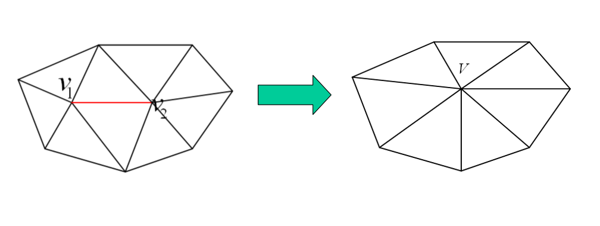
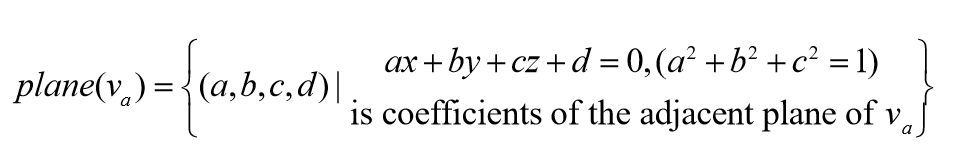
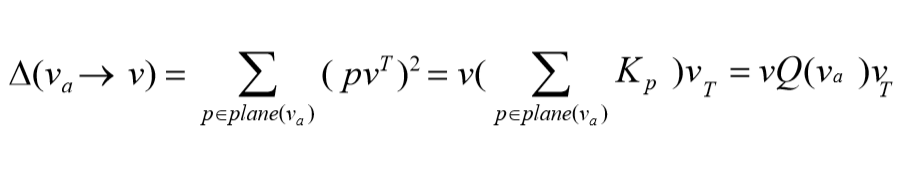
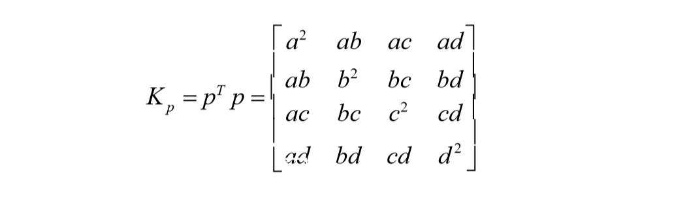
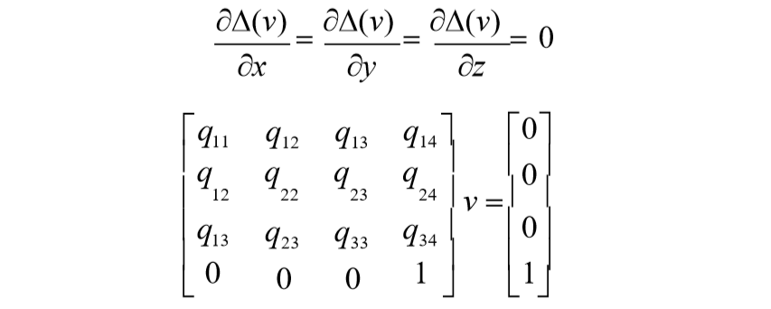
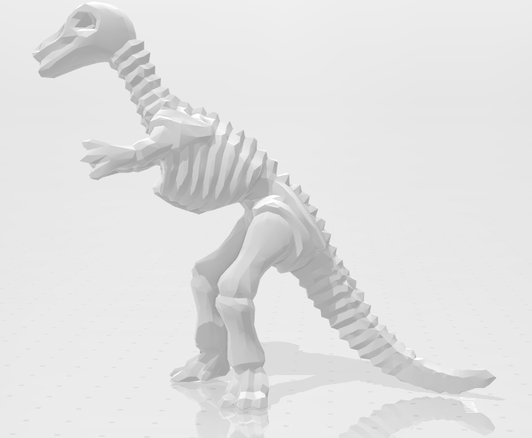
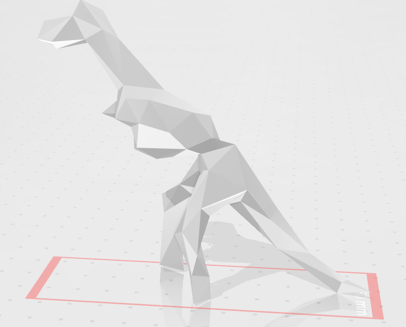

# Mesh Simplification
## Introduction
An OBJ file is a standard 3D image format. And the model depicted in such kind of file is made of various kinds of triangle meshes.  
  
There is a need to simplify such models to reduce the calculation workload and the effect won't be affected when looked from a relatively far view point.  
Edge collapse method based on quadric error matrix which is posed by Garland M., Heckbert P S works very well.
## OBJ file Format
OBJ files we use has the following format:
```
v 1  0 1
v 1  1 1
v 0  1 1
f 1 2 6
f 1 6 5
f 2 3 7
f 2 7 6
```
v means vertex and the following is the coordinate of the vertex.  
f means face and the following are the indexes of three vertexes made of the triangle mesh.
## Edge Collapse Algorithm
The main idea of edge collapse is to merge two vertexes or an Edge to one vertex.  
  
For any vertex in a model, it has may adjacent planes.  
  
The error of moving one vertex to another place can be measured using the following equation.  
  
  
We can get the coordinate of the merged vertex by solving the following equations.  
  
## Compile and Run
First, make sure you have glut on your computer. For Unbuntu users, run the following command to set up the environment.  
```
sudo apt-get install libgl1-mesa-dev
sudo apt-get install libglu1-mesa-dev    
sudo apt-get install freeglut3-dev
```
Once you have everything installed, just simplely run
```
make
```
And you can run
```
make run
```
to simplify horse.obj
## Effect

Compressed to 0.05
  